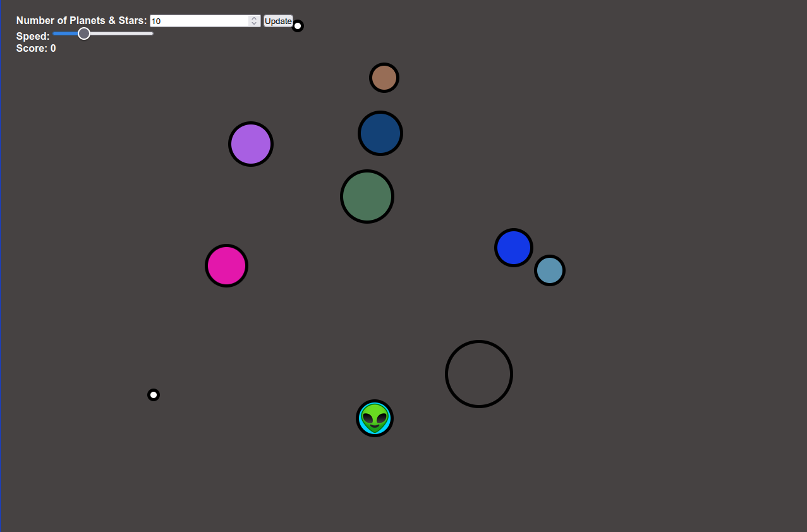

# Spaceships

Here is a basic spaceship game built using JavaScript. The objective is to move the spaceship around to keep destroying all planets and stars on the screen. You can control the spaceship using the arrow keys, WASD keys or by clicking/tapping on the planet or star you wish to destroy.

If you are experiencing collision issues, please note that when the game loads, all spawn points and other calculations are heavily dependent on the current screen size. Should you change the size of the window, move the game to another monitor, etc., please refresh the page to ensure an appropriate configuration is made for the new environment.

## Technolgies Used:
* HTML
* CSS
* SCSS
* JavaScript
